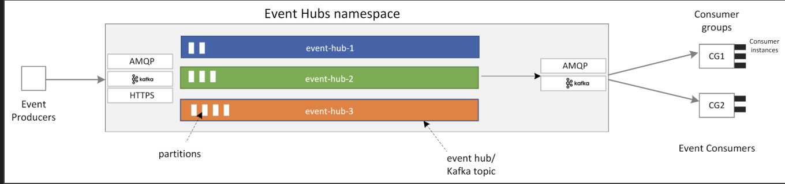
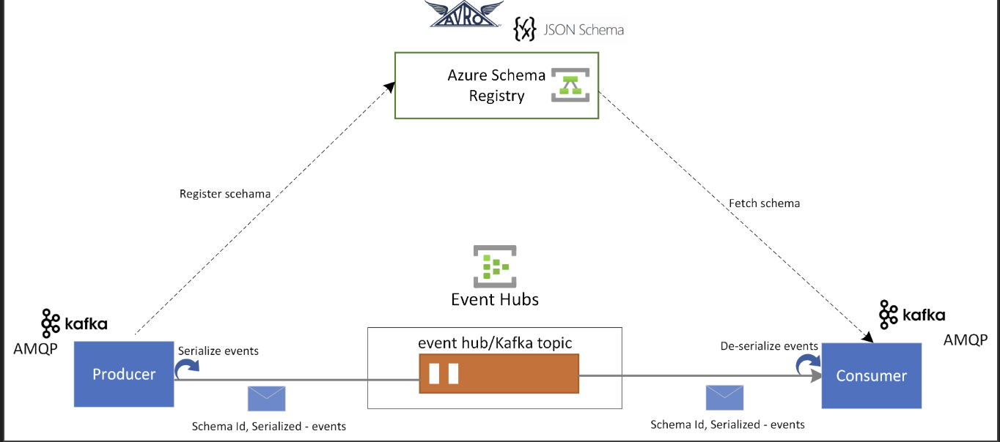
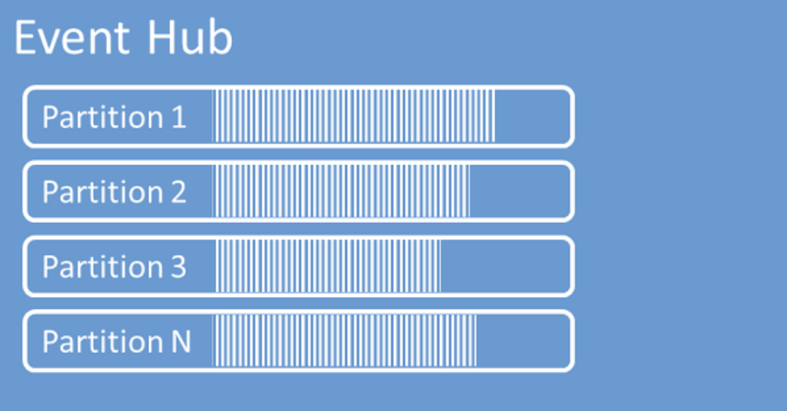

# Azure event hub

* Azure Event Hubs is a fully managed, cloud-based event streaming platform powered by Microsoft Azure. It acts as a hub to collect, consume, and distribute real-time event data from multiple sources, enabling applications to respond to events as they occur.
  

## Some of the core capabilities and features of Azure Event Hubs include:

   - High throughput: Event Hubs can handle large amounts of data, making it suitable for applications with high data requirements.
  -  Scalability: Designed to scale horizontally and vertically to accommodate growth in data flow.
   - Storage: You can allow you to store your data for a certain period of time by determining the retention period of your data.
  -  Partition: Split data into multiple partitions to enable parallel processing and load balancing.
  -  Publish-subscribe model: Supports publish-subscribe distribution model; many users can subscribe to the same event.
  -  Capture: You can capture events and store them in Azure Blob Storage or Data Lake for further analysis.
  -  Authentication and Authorization: Event Hubs offers advanced security options including shared access rights and Azure Active Directory integration.

## Core Concepts
* Before diving deeper into Azure Event Hubs, it's essential to understand some of the core concepts that underlie the service:

-    Event Hubs Namespace: An Event Hubs namespace is a container for one or more event hubs. It acts as a management and security boundary for the event hubs it contains.
-    Event Hub: An event hub is a central component for data ingestion in Azure Event Hubs. Each event hub provides a distinct data stream with its configuration settings. Event hubs can be thought of as channels where data producers send events, and data consumers read events from.
-    Partition: An event hub is divided into partitions. Each partition is a distinct ordered sequence of events. Partitioning enables horizontal scaling and allows multiple consumers to read from different partitions concurrently.
-    Producer: A producer is an entity that sends events to an event hub. Producers can be devices, applications, or services that generate data.
-    Consumer: A consumer is an entity that reads events from an event hub. Consumers can be applications, services, or analytics tools that process and analyze the incoming data.
-    Event: An event is a unit of data that producers send to event hubs. Events can represent various types of data, such as telemetry, logs, or any real-time data.
-   Checkpoint: Checkpoints are used by consumers to keep track of the last event they have processed. This helps in resuming event processing from the last known checkpoint in case of failures or restarts.

## Event Hubs vs Event Grid vs Service Bus (Simple)
1. 📊 Azure Event Hubs
- Used for handling large data streams
- Can process millions of events per second
- Mainly for real-time analytics & logging
-  Example: IoT sensors sending continuous data

2. ⚡ Azure Event Grid
  -  Used for reacting to events instantly
  -  Works on event-based triggers
  -  Connects different Azure services automatically
  -  Example: When a file is uploaded → trigger a function

3. Azure Service Bus
  -  Used for reliable communication between services
  -  Supports queues and topics (pub-sub)
  -  Ensures message delivery, ordering, retries
  -  Example: Order processing system in e-commerce

## Why choose Azure Event Hubs?
* Zero infrastructure management, Kafka without the complexity, Flexible pricing
  Flexible pricing
 

## Data management
   - Stores schemas in one place
   - Ensures producer & consumer use same format
   - Handles schema changes safely (schema evolution)
   - support json and avro format
  

## capture 
* A feature that automatically saves your streaming data into storage (Blob / Data Lake) in near real-time.
  
## Stream Analytics integration
* Event Hubs integrates with Azure Stream Analytics for real-time stream processing. Use the built-in no-code editor with drag-and-drop functionality, or write SQL-based queries for complex transformations.
## Azure Data Explorer integration
* Azure Data Explorer delivers high-performance analytics on large volumes of streaming data. Integrate Event Hubs with Data Explorer for near real-time analytics and exploration.

# Authentication
*	Microsoft Entra ID with role-based access control (RBAC), Shared Access Signatures, or Managed Identities

# Compression
* Kafka compression batches multiple messages into a compressed payload at the producer, which is transparently decompressed at the consumer while the broker treats it as a single message.
> Compression.type = none | gzip (u can write while producing an event)

## Partitions
* event Hubs organizes sequences of events sent to an event hub into one or more partitions. As newer events arrive, they're added to the end of this sequence
* paritioning is done by keys

---

## Apache Kafka and Azure Event Hubs conceptual mapping
* Conceptually, Apache Kafka and Event Hubs are very similar. They're both partitioned logs built for streaming data, whereby the client controls which part of the retained log it wants to read. The following table maps concepts between Apache Kafka and Event Hubs.
* While Apache Kafka is software you typically need to install and operate, Event Hubs is a fully managed, cloud service. There are no servers, disks, or networks to manage and monitor and no brokers to consider or configure, ever. You create a namespace, which is an endpoint with a fully qualified domain name, and then you create Event Hubs (topics) within that namespace.
* If you enable the Auto-Inflate feature for a standard tier namespace, Event Hubs automatically scales up TUs when you reach the throughput limit. This feature also works with the Apache Kafka protocol support.
---
## Secure Access in Event Hubs (Kafka)

* When your Kafka client (producer/consumer) connects to Azure Event Hubs, 2 things must happen:

*  Encryption 🔐 (data safety)
      -  Event Hubs forces TLS (SSL)
      -  So all data sent = encrypted in trans
  
## OAuth 2.0
* Event Hubs integrates with Microsoft Entra ID, which provides an OAuth 2.0 compliant centralized authorization server. By using Microsoft Entra ID, you can use Azure role-based access control (Azure RBAC) 
* AMQP(Advanced Message Queuing Protocol)

##  Getting Started with Azure Event Hubs

* When you create an Event Hubs namespace, the Kafka endpoint for the namespace is automatically enabled. You can stream events from your applications that use the Kafka protocol into event hubs.
### Create an Event Hubs Dedicated Cluster
* 