# Databricks
---
## Databricks connectors:
* These are tools/plugins that allow databricks to talk to external systems - databases, storage systems, SaaS applications etc.
* so you can read from them or write data to them.

| Connector | Use Case |
| --- | --- |
| JDBC/ODBC Connector | Connect to relational databases (MySQL, PostgreSQL, SQL Server, Oracle, etc.) to read/write structured data |
| Azure Blob Storage Connector | Read/write files (CSV, Parquet, JSON, etc.) directly from Azure Blob Storage |
| Azure Data Lake Storage (ADLS) Gen2 Connector | Optimized for big data analytics; read/write large datasets with high performance |
| Azure Cosmos DB Connector | Read/write semi-structured data from NoSQL databases |
| Azure Key Vault Connector | Securely access secrets, keys, and certificates from Azure Key Vault |
| HTTP Connector | Fetch data from REST APIs and web services |
| File System Connector | Read/write files from the local file system or DBFS (Databricks File System) |
| SFTP Connector | Securely transfer files over SFTP protocol |
| Delta Sharing Connector | Share Delta tables securely with other Databricks workspaces or external systems |
| Unity Catalog Connector | Manage data governance and access control across the lakehouse |
| AWS S3 Connector | Read/write data from Amazon S3 buckets (for cross-cloud analytics) |
| Delta Lake Connector | Read/write Delta tables with ACID transactions and schema enforcement |
| Iceberg Connector | Read/write Apache Iceberg tables (open table format) |
| Hudi Connector | Read/write Apache Hudi tables (incremental data processing) |


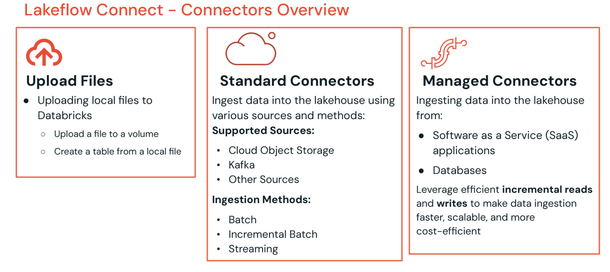

### ingestion methods
* when ingesting data into databricks using  lakeflow connect standard connectors, you can choose from serveral methods.
1. batch ingestion : loads the data in batches of the rows based on the schedules, but while loading the data it load whole data every time.


2.increamental batch ingestion: automaticaly detect new records in the data sources and skips the record which are already loaded in previous batches. this is fast and resource efficient.
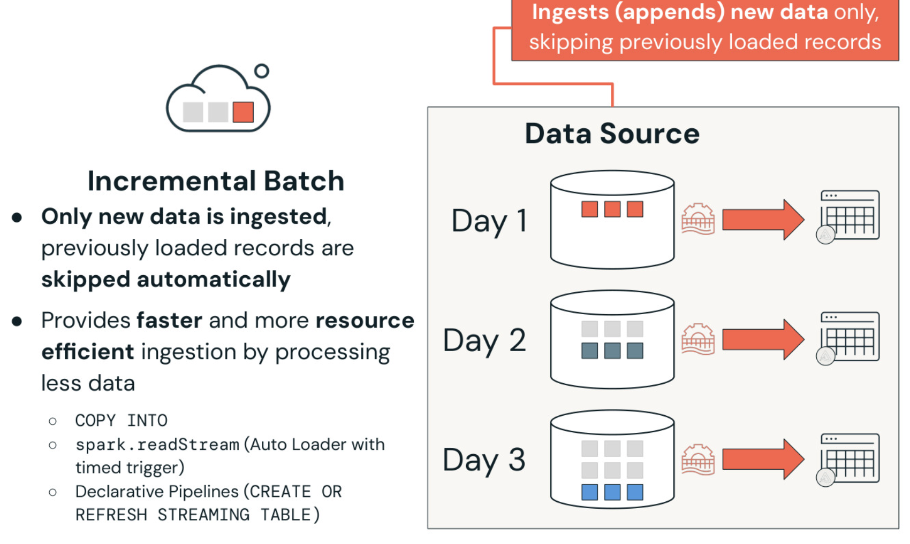
3. streaming ingestion : in this data is continuasly loaded as it generated, and allow use to query in real time, this method is ideal for loading data from source like apache kafka, amazon kinesis, pub/sub,and apache pulsar.


---
## Delta lake :
* Delta Lake is an open-source storage layer that sits on top of your data lake (like Azure Data Lake / S3) and adds reliability, transactions, and versioning to your data files.

* the goal is to ingest the data from external source like cloud storage into delta lake as delta tables, remember delta lake is simplly open source protocal to read and write data into cloud storage.

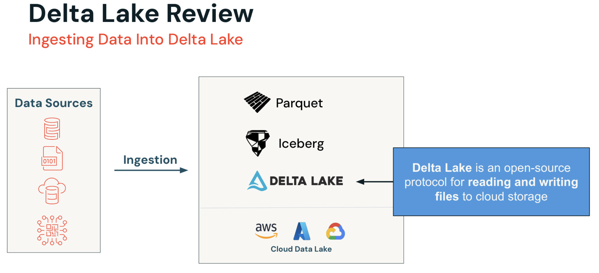

* under the hood , delta tables store the data in within a folder directory, within the folder directory data is stored are parquet files,and what delta adds is delta logs stored as json files along with its parquet files. these logs keeps the track of all the transactions of the data of parquet files and table versions.
* within the transation log, we now have the concept of the table states,so now if you insert, delete, update the data of your tables, delta basically add the transation(the log file) and your table stays updated and managed.
* so with the transation log you are able to easly gets views of your data,and you can able to **travel back** in time. 
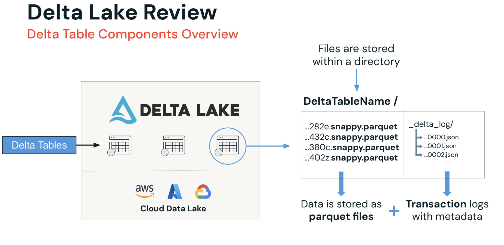

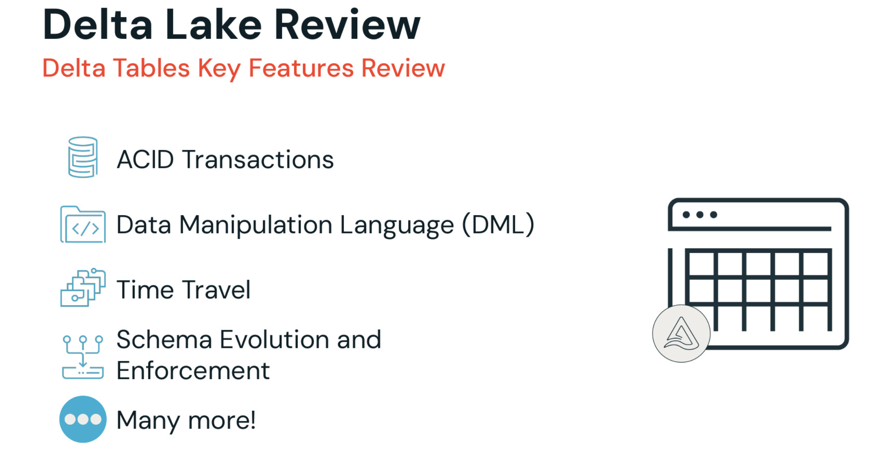

1. ACID : with the help of this multiple users can perform operation concurrently, and there will be no data loss
2. DML : we can perform operations such as insert, delete, update and merge, enabling flexible data management.
3. Time travel : we can query and rever prev versions of the data, facilitating auditing and recovery.
4. Schema Enforcement and Evolution : define schema for data integrity, delta tables will validate the data before writing into the tables,while evolutin mean we can add new columns in the table without breaking workflow.

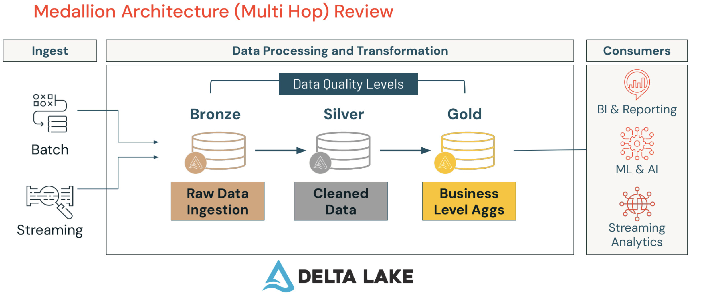
* As you ingest the data in to your delta lake through batch or streaming ingestion,or both . then you can begin processing and transforming your data into databricks.
* it begins with bronze layer, the row data ingestion layer,this layer ingest the row and unprocessed data from different data sources,and serving the fundamental storage for all data.
* in silver layer the data is cleaned, transformed and enriched and provied more refined dataset for later analysis.
* later gold layer contains business specific data, aggregated, and ready for business decision. 

---
## Data ingestion from cloud storage :

* data ingested from claud storage, row files are effieciently  converted into delta tables using databricks tools.

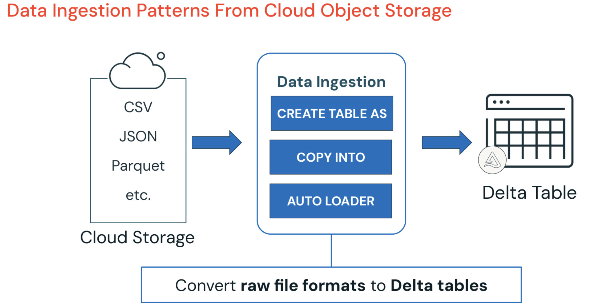

* we discussed about 3 methods of the data ingestion from cloud storage into delta tables.
    1. create table as(ctas)
    2. copy into 
    3. auto loader

 
1. **create table as(ctas)**:
   * this stmt creates a delta table by default from files stored in claud storage.

   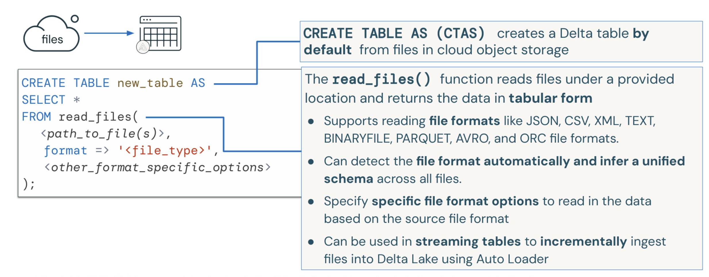
   * the read_files() function  is used read files from specific locaion(claud storage) and return the data in table format, it offers several capabilities.
     1. support varias file format
     2. automatically detect file format and and infer unified schema across all files.
     3. can be used in streaming tables to increamently ingest files into delta lake using auto loader
2. **copy into** :
    * this command performs bulk load from files in cloud storage into the tables.
    
    * means copy into skips any files that already been loaded into the table, and only new files will be ingested .
    * format_option() : lets you control the control behavior of the copyinto operation itself,for example schema evaluation using mergeSchema.
3. **Auto Loader** : 
    * auto loader increamently and effiecently load new data files in either in batch or streaming mode as they arrives in cloud object storage,and it does this without any additional steps.
    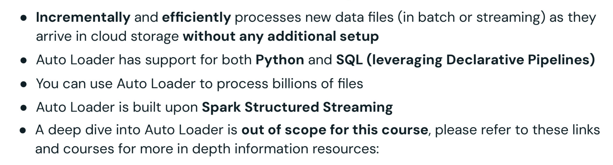
    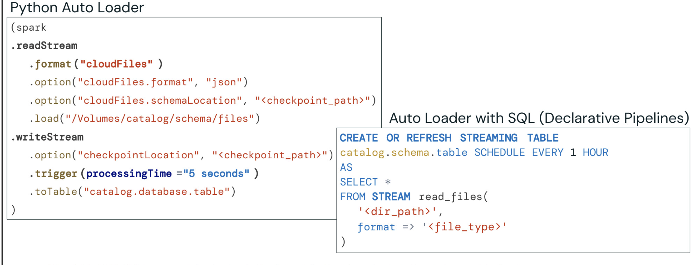
    * cloudfiles.format : it tells auto loader to what type of files to expect in the directory, such as csv, json, parquet, etc. This setting is necessary for the auto loader to properly parse and process the files.
    * schemalocation:save or remember the structure(schema) of the data here, so i dont re detect it every time.
    * trigger( time = x seconds): check for new files every 5 second and process them - the hearbeat interval is the time gap between each check. 
    * to create streaming table from the files in volume you use auto loader , databricks recommands using auto loader with lakeflow declrative pipelines for most of data ingestion tasks from the cloaud storage
    * streaming table : this is delta table that continously updates itself as new data is ingested into it, and allows you to query the data in real-time.
    * streaming tables in databricks sql are backed by serverless lakeflow declarative pipelines. your workspace must support serverless piplines to use this functionality. alternatively, use can build your own lakeflow declarative pipelines for incremental processing, optimzation and monitoring. 
    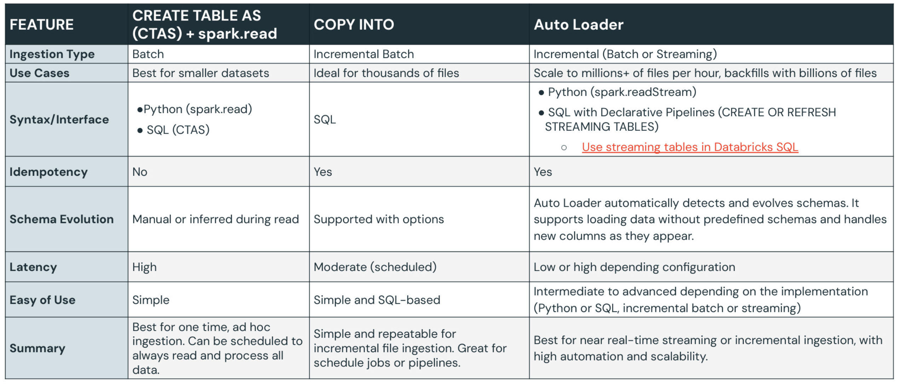

---

## Appending metadata column on ingestion 

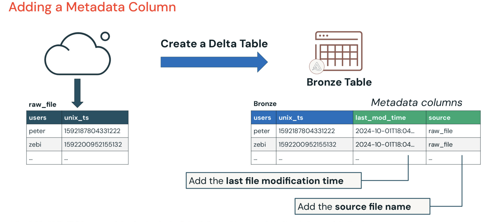
* you can append metadata column info  from input data source files when creating table .
* this is very important for tracking the info of table ,auditing,lineage, and debugging purpose.

## working with rescued data column 

* during ingestion there are times when input data does not match with schema in your table. ingestion technique like read_file(),spark.read, autoloader provide rescued sdata column during ingestion.this make sure that incoming data which fail in schema validation is not lost.
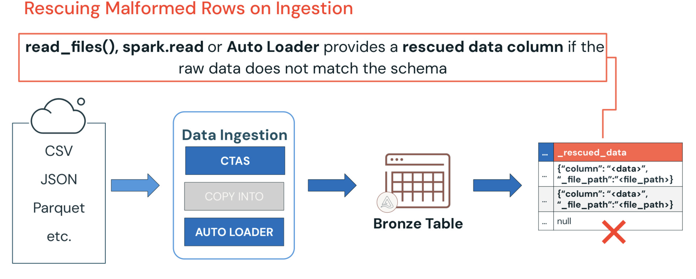
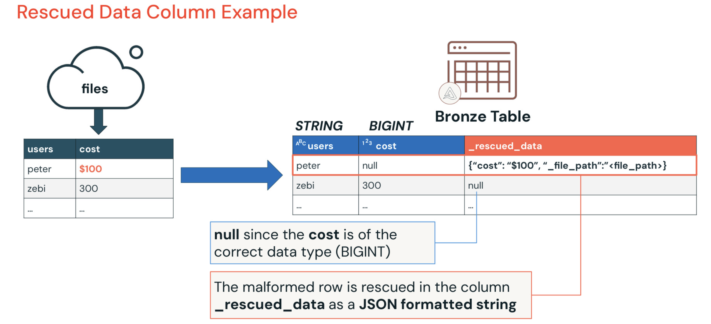
* when we ingest data then user column must read as string in table and cost column must be in Bigint 
* see in first row user column passed the validation but cost column contain value as string like $100 which is failed to load because expection is like that in bigint
* so instead of simply droping that column simple we add new column name rescued data where we add this cost as json format and actual cost column filled with null value.

## Ingestion json formated data

* 
* we deal with this type of data commanly when dealing with event data, logs, data from apis
* these object can be flat means all the key: value pair can be in single level,or they can be in nested structure, where value also can be in nested structure.
* 
* its common that after ingestion one or more column in your table might cantain json-format string as values.
* so the techniques to parse these json objects,extract,manipulate these json string using sql or dataframe operation.so that you can access these key value pair like a common column field.
* 
* a key point to remember:
    1. a column can store json string or json object as string.
    2. so its just row text from system perspective.
* to access subfield from json formated string column, you can use the colon(:) syntax.
* 
* lets go through the process of mapping json formatted string into struct column 
    * so the first step to define json formatted schema of json formatting string .
    * defining the schema allow you to tell databricks how to interpret each part of json string and how to convert these into appropriate data type within a struct.
    * 
    * 
* these can be done with these 2 steps:
    - first step is to get schema of the json format string
    - now instead of manually defining schema, you can use builtin schema_of_json() function to automatically define the schema of the example json string.
    ```sql
   select schema_of_json(json_col, 'json-struct-schema') as struct_column
   from table;
    ```


* some major benifits of variant  data type includes:
    - it can store any type of data including json, making ideal for semi-sturctured data.
    - it is highly flexible, it can adapting to different data shapes without rigit schemas
    - if offers improved performace as compared to existing methods for handling semi-structred data.
* working with **variant column(Public preview)**:
    - full open source,no strict schema.
    - you can put any type of semi-structured data into variant column.
    - improved performance over traditional methods.
    - this will not work in serverless compute.

### Parsing and Querying Variant Columns

1. **Parsing JSON into Variant**:
   Use `parse_json()` to convert a raw JSON string into a binary `VARIANT` data type.
   ```sql
   SELECT parse_json('{"user": "Anil", "age": 28, "skills": ["SQL", "Spark"]}') AS my_variant;
   ```

2. **Querying Fields using Colon (`:`) Operator**:
   You can extract values using the colon `:` operator without any schema definition:
   * **Top-Level Field**: `my_variant:user`
   * **Nested Field**: `my_variant:details.city`
   * **Array Element**: `my_variant:skills[0]`

3. **Casting Variant Fields to Primitive Types**:
   By default, path traversal on a `VARIANT` returns another `VARIANT`. To get a regular data type (like string or int), cast it using `::` or `cast()`:
   ```sql
   SELECT 
       my_variant:user::string AS username,
       cast(my_variant:age AS int) AS age
   FROM table;
   ```

4. **Functions for Parsing and Retrieval**:
   * **`variant_get(col, path, target_type)`**: Extract value with a JSON path (e.g., `'$.user'`). Fails if cast fails.
   * **`try_variant_get(col, path, target_type)`**: Safer version. Returns `NULL` if path does not exist or if cast fails, rather than raising an error.
   ```sql
   SELECT try_variant_get(my_variant, '$.skills[0]', 'string') AS first_skill;
   ```

---

## Ingestin interprise data overview :

* connection interprise data is streamlined with lakeflow connect managed connectors and partern connect enabling fast and reliable data integration from databases and application into databricks lakehouse- with fully managed and flexible options.
* 
    - so far we have discussed how to ingest data from cloud storage using ctas, copy into and autoloader but what if data stored in databases, and external applications?
* 
    - first method of ingest data from interprise application is lakeflow connect managed connetors.
    - this simply the process of ingesting data from varity of the interprise databases and applictions.
    - with low code, fully managed experience to connect, ingest and synchronize data from external sources into the databricks lakehouse.
    - it also provide easy to use UI for user and also provide API .
* 
    - these are highly efficient , databricks managed connectors designed specially for fast, reliable ingestion into your lakehouse.
* 
    * how it works:
        - a lakehouse declarative pipelines job collects credentials from unity catalog.
        -  the service transform the data and store it into streaming delta table.
    * its primary role is to connects to public SAAS based sources(salesforces,workdays..) extract the data and ingest it into streaming table.
* 
    - like with public saas connectors, this architecture is designed to move data into streaming table- but this time from external databases rather than external API.
    * how it works:
        - A classic compute  declarative pipelines job retrives credentials securely from unity catalog.it connect to data using JDBC and retrive data from source table in batches.
        - it use those credentials to connect with external databases.
        -  the jobs collect latest state and change the logs and storing staged data into unity catalog volumn.
        - serverless declarative pipelines job then process staged data and load it into streaming delta table.

    * We are introducing two new architectural elements are:
        * ingestion :
             * a dedicated pipelines that connect database to extract : **metadata, snapshot, change logs**
        * unity catalog volumn:
             * this act as intermediate staging layer, enabling the next pipeline to pick up and stream data.
             * its secured using standard UC mechanism, and by default access is limited to users running the pipeline.
            
## data ingestion with parter connectors:

* if there is not managed connector availabe for your specific data source, for that you can also use partner connect.
* with partner connect you can get a list of all the available partner connectors, and you can use them to ingest data from your data source to your lakehouse.
* 

---
## Delta Sharing & Databricks Marketplace

* Databricks provides a secure, open, and efficient way to share data and AI assets both internally and externally through **Delta Sharing** and the **Databricks Marketplace**.

### 1. Delta Sharing (The Protocol)
* **What is it?** An open-source protocol developed by Databricks for secure, real-time data sharing across different organizations and platforms without replicating or copying data (zero-copy).
* **Key Features:**
    * **Open Protocol:** Recipients do not need to use Databricks. They can query shared datasets using standard tools like Power BI, Tableau, pandas, Apache Spark, or Python.
    * **Zero-Copy & Live Data:** Data is shared directly from cloud storage (like ADLS Gen2/S3). Recipients always query the latest "live" version of the data, eliminating outdated static file dumps.
    * **Security & Governance:** Fully integrated with **Unity Catalog** to provide centralized auditing, access control, and usage tracking.
    * **Cross-Cloud & Region:** Share data across different cloud providers (Azure, AWS, GCP) and regions seamlessly.

### 2. Databricks Marketplace (The Exchange Hub)
* **What is it?** A public or private exchange forum built on top of Delta Sharing that allows providers to package, publish, and distribute data products and AI assets, and consumers to discover and access them.
* **Beyond Just Raw Tables:** Unlike traditional data marketplaces, Databricks Marketplace supports sharing a variety of assets:
    * **Data Products:** Structured and semi-structured datasets.
    * **AI/ML Assets:** Pre-trained machine learning models and LLM agent skills.
    * **Analytical Assets:** Databricks Notebooks, dashboards, and complete custom applications.
* **Clean Rooms Integration:** Facilitates secure, privacy-preserving collaborations where two or more parties can analyze sensitive datasets together without exposing raw data to each other.
* **No ETL Required:** Consumers can instantly mount and query published assets without setting up complex ingestion or replication pipelines.

## Ingestion into exiting delta table:

* 
* there are situations where you need to update, insert, delete records in target table based on info of another table.
* 
```sql
    MERGE INTO target_table target
    USING source_table source;

    -- specify the condition for merging
    MERGE INTO target_table target
    USING source_table source;
    ON target.key = source.key
    f
```

---
---

# Deploy workloads with Lakeflow Jobs

* it all begins with optimized storage with delta lake, parquet or iceberg.
* buit on top of this storage layer is unfied governance with unity catalog. unity catalog is centerized data catalog that provide access control, auditing, data quality, data lineage and data discovery over databricks workspace.
* databricks then offer lakeflow. an end to end data engineering solution that empowers data engineers,software developer, sql developers,analytics and data scientist to build reliable, scalable and maintainable data pipelines.this provides unified platfrom for data ingestion, transformation, orchestrations and monitoring.
    - **lakeflow connect** : A set of efficient ingestion connectors that simplify data ingestion from popular saas applications and databases, cloud storage,message buses and local files.
    - **lakeflow declarative pipelines(LDP)** : A framework for building batch and streaming data pipelines using sql and python, designed to accelerate **ETL** development.
    - **Lakeflow jobs** : A workflow automation tools for databricks that orchestrates data processing workloads. it enables coordination of multiple tasks within complex workflows, allowing for the scheduling, optimization, and management of repeatable processes.


## What is lakeflow jobs?:


* this diagram captures a fundamentals challenge in modern data architecture. choosing the right orchestration approach for lakehouse. the left panel shows multiple options including open source solutions(Apache airflow, Perfect, Dagster,dbt), cloud native services(aws,azure, google cloud), and custom in house frameworks.

* diagram on right illustrate a typical data workflow with multiple steps: ingesting sessions and clicks data,joining them , performing featurization and aggregation, analysis and training models, then you have various downstream uses including BI & data warehousing, Data streaming and data science & ML.


* many orgs uses external orchestration tools, but this creates significant challenges, data teams becomes less productive because these tools are hard to use for many practitioners, bad data quality lower the value of downstream applications.

* You also face higher costs of ownership and lower reliability, when issue occur, it's difficult to understand root cause. The complex architecture become hard to manage and maintain.

* most importantly these external tools are not inified with your lakehouse creating integretion challenges and data silos.


* This is where lakehouse jobs comes in, it provides unified orchestration for data, analytics and ai workloads directly on the data intelligence platform. 

* The key benifits are simple authoring, actionable insights,and proven reliability, because it's native to the plateform it integrates seamlessely with data ingestion & transformation the processing engine(photon), governance( UC), storage(delta lake), data warehousing,and machine learning capabilities .

* The workflow shown here - from sessions and clicks through join, featurize, aggregate, and train - all runs natively within the same platform eliminating the integration challenges of external tools.


*  this slides shows the complete arichitecture of lakeflow jobs, at the center is the workflow engine that coordinates everythings.
* The compute layer support various workload types: ETL,ML/AI, and analytics/BI operations.
* you have multiple trigger types: scheduled(time based), continous(always-runnnig) file arrival(event-driven), table updates.
* two critical components support the entire system: obeserability for monitoring and troubleshooting and control flow for managing task dependencing and execution order.


## Builing Blocks of lakeflow jobs:

* here are the two most fundamental concepts you need to understand:
*  a job is the primary resource for scheduling , coordinating and running operations such as data processing, etl, analytics,and ML workloads within the databricks enviroments, think of a job as the container that holds your entire workflow.

* A task is a single unit of work within a job that executes a specific workload such as a notebook, script, query and more, task are the individual building blocks that do the actual work.

* The relationship is hierarchical: each job cosists of one or more tasks, which are individual units of work that make up the job. the visual shows this clearly - one job containing multiple tasks.


* jobs consist of one or more tasks, and there are many different task types available, you can use databricks notebook in any supported lang. , python script,python wheels for packaged code, sql queries, dbt models, java jar files,spark submit jobs for lagacy spark application, AI/BI dashboards for visulisation, and even power BI integration.

* This varity ensure that you can orchestrate virtually any type of workload within your job .


* when you create a job, you can set specific configurations for each particular task, the options available depends on the task type you select, common confiquration option include defining the path to your code, adding libraries, setting parameters, enabling notifications, and configuring  retry policies.

* these configurations allow you to better orchestrate each particular task according to your specific needs.


* here a specific example for notebook tasks, when you select notebook task type, you get options like specifying the source path to your notebook, choosing compute option( cluster confi.)and many more settings specific to running notebooks.
* the interface adapts based on your taks type selection, providing relevant config. options.


* similarly ,for sql tasks , you get different options you can specify the aql task details, write or reference your sql query and select the sql  warehouse that will execute your query.

* each task type provides the specific configuration options tailored to that task type.


* we already learned about jobs and task .
* this comprehensive view shows how tasks can be connected with different control flow pattern, you can implement sequential , paralel execution, conditional logic, fan-in/fan-out pattern , run job tasks for modular design and for each loop for iterative processing.

* additionally jobs supports different trigger types: manual triggers for on demand executions, scheduled triggers using cron expressions, api triggers for programmatic exacution, file arrival triggers for event driven processing table triggers for data change events,and continous triggers for streaming workloads.


* jobs can be exuecuted on different types of compute and choosing the right compute is crucial for both performance and cost.

* interactive cluster can be shared by multiple users and are best for ad-hoc analysis ,data exploration or development, however they should not be used in production as they are not cost effective.d
* job clusters are approximately 50% cheaper as they terminate when the job ends, reducing resource usage and costs.  they are ideal for production workloads, through they are subject to cloud provider start up times .with databricks jobs, you can reuse the same cluster across task for better price performance.

* serverless provide a fully managed service that is operationally simpler and more reliable it offer faster cluster and auto scaling capabilities providing better user exp. for lower cost, with out of the box performance optimizatios, serverless providers lower overall TCO.

* sql warehouse is purpose built for sq queries, dashboard, and BI and is serverless by default , it offer high concurrency and autoscaling vai intelligent workload management, with auto-start/auto-stop and adjustable cluster sizing to help control costs.


* serverless tasks,you can use the performance optimzed setting to choose between lower cost and faster execution.

* standard mode, focuses on cost-efficiency with longer startup time(typically 4-6minutes), making it best for non-urgent workload with flexible timing.

* optimized mode enables faster job , startup and execution, making it ideal for time-sensitive workloads,this setting applies only to tasks with serverless compute in your job.


* this diagram illutrates an important principle: a job can have one or more task insider it and each task can be assigned its own compute resource. tasks in the same job can either share the same compute or use different compute as required .

* you might have task-1 running on an all purpose cluster, task -2  on serverless, task-3 on a job cluster, and so on. this flexibility allows you to optimize cost and performance for each task individually.

---

## Task Orchestration :


* A dag is a conceptual representation of a series of activities, including data processing flows, lets break down the acronym.
    - Directed means there's an unambigous direction of each edges- tasks flow in a specific direction
    - Acyclic means it contains no cycles- you can't have circular dependencies where task A depends on task B which depends on task A.
    - Graph means it has a collection of vertices connected by edges - in our case, vertices represent tasks and edges represent the dependencies between them.


* databricks jobs support task orchestration through the ability to run multiple tasks as a directed acyclic graph(DAG). you can orchestrate tasks using the databricks UI, API, SDK or databricks asset bundles.

* the example shows that task2 depends  on task1 , task3 also depend on task 1 and task4 depends on both task2 and task3. you define the order of execution by configuring these task dependencies , creating a DAG of task execution

* this approach allows you to build complex workflows while maintaining clear dependencies and execution order.


* there are 3 approach to this:
    - sequence pattern is used for data transformation, processing, cleaning, and building bronze/silver/gold  table in a medallion architecuter.
    - funnel pattern brings together multiple data sources for data collection and consolidation.
    - fan-out or star pattern takes a single data source and distributes it for data ingestion and distribution to multiple downstream systems.

    
## Course Project Overview

* in this section you will get an overview of  the course project. where you will build a retail pipeline from a retail dataset using different tasks available in lakeflow jobs.


* this diagram shows our complete course project architecture, we will build a retail data processing pipeline that demonstrates all the concepts we are learning.

* starting with retail data in cloud storage, we will ingest customer,sales and orders data using different task types, we will join customers and orders and customers and sales using notebook tasks, the workflow includes an if/else block for checking duplicates with true and false conditions.

* we will implementa for each task for state - wise iteration on customer orders data. finally we will create a retail dashboard using a dashboard task.

* this project incorporates sql tasks, notebook tasks, if/else logic, iterative processing and dashboard creating - giving you hand-on exp. with all major  lakeflow jobs features.


---
---
 ## Common Task configuration Options

 * lets start with the common configuration options that you apply to your tasks. These settings are key to building workflows that are not just automated, but also dynamic,context-aware and easy to monitor.

 * we all how to pass values into your tasks and how to set up alerts.

 

 * lets me walk you through the three major categories of task configuration options:

 * parameters & dynamic values refereces are the foundation of flexible workflows. these can only be set at the task level and allow you to create reusable ,adaptable tasks that can behave differently based on the context or input.

 * retries are your first line of defense against transient failure. you can configure retry behavior at both job and task levels. allowing for different retry strategies depending on the criticality and expected failure pattern of different parts of your workflow.
 * notification alert keeps your team informed and enable rapid response to issue. like retries, these can configured at both job and task levels, giving you granular control over who gets nofified about what events.

 

 - understanding the parameter hierarchy is crucial for effective job design:

    - task parameters are key - value pairs or json array defined at the individual task level. these are specific to each taks and allow for fine-grained control over task behavior.
    - job parameter are defined at the job level and automatically propogate to all tasks within that job. this create a powerful inheritance model where you can set common defaults while still allowing task specific overrides.
- The precedence rule is critical to remember: job parameters always override task parameter when the same key exits. this design pattern allow you to establish sensible default at the job level while manintaining the flexibility to customize individual tasks when needed.


- Task parameters are far more than simple configuration values they are the building blocks of intelligent workflows. these key value pairs enable sophisticated orchestration pattern:
    * conditional execution : use parameters to control which branch of your workflwo execute based on data conditions, env. settings, or business rules.
    * looping : parameters can control iteration counts, define arrays for for-each loop , and manage complex processing scenarios.
    * context passing : share info between tasks by setting parameters that downstream task can read, creating a data flow alongside your control flow.

- the real power comes from combining parameters with dynamic values references, allowing your workflows to adapt intelligently to changing conditions and data characteristics.


- Job parameters serve as the foundation for consistent, maintainable workflows. they are key-value pairs that provide default values to for your entire workflow, ensuring consistency across all tasks.

- Here's what makes them powerfull : 

    * Automatic application : every task in the job automatically receives these parameters, eliminating the need to manually configure common settings across multiple tasks.
    * Override capability : tasks can still define their own parameters with the same key names. but job parameters take precedence, giving you centralized contorl.
    * Runtime flexibility : you can override job parameters when triggering job runs, allowing the same job defination to behave differently for different scenarios - perhaps different env.,date ranges, or processing modes.


- let's look at the practical implementation of parameters:

    * **Setting Job Parameters:** navigate to your job's Parameters section and add key-value pairs at the job level. these become available to all tasks automatically. common examples include catalog names, schema names, environment settings, and processing dates.

    * **Setting Task Parameters:** within each task's configuration (found alongside task name, type, and path settings), add task-specific key-value pairs. these are perfect for task-specific paths, processing options, or override values.

    * **Retrieving in Notebook Tasks:** use `dbutils.widgets.get("parameter_name")` to access both job and task parameters. the system automatically handles the precedence - if both job and task parameters exist with the same key, you'll get the job parameter value.

    * **Language-Specific Retrieval:** remember that parameter retrieval methods vary by task type. SQL tasks access parameters differently than Python wheel tasks or JAR tasks. always check the documentation for your specific task type.


- Dynamic Value References using `{{ }}` notation unlock powerful runtime capabilities that make workflows truly adaptive:

- **Job Context References:**
    * `{{job.start_time.day}}` - access execution timing for date-based processing
    * `{{job.run_id}}` - unique identifier for tracking and logging
    * `{{job.parameters.environment}}` - access job-level parameters dynamically

- **Task Context References:**
    * `{{task.name}}` - useful for logging and dynamic path generation
    * `{{task.retry_count}}` - track retry attempts for debugging

- **Inter-Task Communication:**
    * `{{tasks.data-validation.values.record_count}}` - access computed results from upstream tasks
    * `{{tasks.file-processor.values.output_path}}` - use dynamic paths generated by other tasks

- **Advanced Patterns:** these references enable workflows that adapt to different execution environments, process varying data volumes, and make intelligent decisions based on upstream results.


- Notification alerts form a critical part of operational excellence, and understanding the configuration levels helps you build effective alerting strategies:

- **Job Level Notifications:** configure these in the Job Details section's right-side pane. job-level alerts are sent after the entire job completes successfully. this is perfect for stakeholders who need to know when complete workflows finish, such as business users waiting for daily reports or downstream systems that depend on your job's outputs.

- **Task Level Notifications:** each task can have its own notification configuration, allowing granular alerting strategies. this is essential when different tasks have different stakeholders or when certain tasks are more critical than others. for example, you might want immediate alerts for data validation failures but only summary notifications for routine cleanup tasks.

- **Strategic Considerations:** design your notification strategy based on operational needs, not technical convenience. consider who needs to know what, when they need to know it, and what actions they can take based on the notification.


- modern production environments require sophisticated notification strategies:

- **Multiple Destinations:** support for Emails, Microsoft Teams, PagerDuty, Slack, and Webhooks means you can integrate with your existing operational tools and communication patterns. different teams might prefer different channels - developers might want Slack notifications while operations teams prefer PagerDuty integration.

- **Per-Task Customization:** each task in a job can have completely different notification configurations. your data ingestion tasks might send alerts to the data engineering team, while your reporting tasks notify business stakeholders.


- a well-designed retry policy is essential for resilient workflows. the policy determines not just how many times to retry, but under what conditions and with what timing patterns.

- consider factors like:
    * **Failure Type:** transient network issues might warrant immediate retries, while data quality issues might not
    * **Resource Impact:** retrying resource-intensive tasks too aggressively can cause cluster resource contention
    * **Downstream Dependencies:** failed tasks might impact other workflows, making retry timing critical
    * **Business SLA:** some processes have strict timing requirements that limit retry windows

## Job Schedules and Triggers


- a trigger is fundamentally a rule engine that automatically initiates job execution based on specific conditions or schedules. this isn't just about convenience - it's about building reliable, responsive data systems that can operate autonomously.

- **Trigger Categories:**
    * **Time-based schedules:** traditional cron-style scheduling for predictable, recurring workloads
    * **Continuous execution:** always-on processing for streaming data scenarios
    * **File arrival events:** event-driven processing that responds immediately to new data
    * **Manual triggers:** on-demand execution for development, testing, and ad-hoc analysis
    * **Table Update:** for enabling automated job execution as soon as specified tables are updated


- a **trigger** is a rule that automatically starts a job run based on a **specific condition** or **schedule**.
- common trigger types include:
    1. Time-based schedules
    2. Continuous (always-on) execution
    3. File arrival events
    4. Manual trigger
    5. Table Update
- triggers **enable automation**, so jobs can run without manual intervention.


- scheduled triggers are the backbone of most production data workflows, providing reliable, time-based execution:

- **UI-Based Scheduling:** the Databricks interface provides intuitive scheduling options for common patterns - hourly, daily, weekly, monthly. this is perfect for business users and reduces the learning curve for cron syntax.

- **Cron Expression Power:** for more complex timing requirements, full cron expression support enables sophisticated schedules like "every 15 minutes during business hours" or "first Monday of each month."

- **Use Case Patterns:**
    * **Daily ETL:** process yesterday's data every morning at 6 AM
    * **Weekly Reports:** generate executive dashboards every Monday morning
    * **Monthly Aggregations:** calculate monthly KPIs on the first day of each month
    * **Hourly Streaming Checkpoints:** regular maintenance for streaming jobs

- **Timezone Considerations:** always specify the appropriate timezone for your business context, especially for organizations operating across multiple regions.
